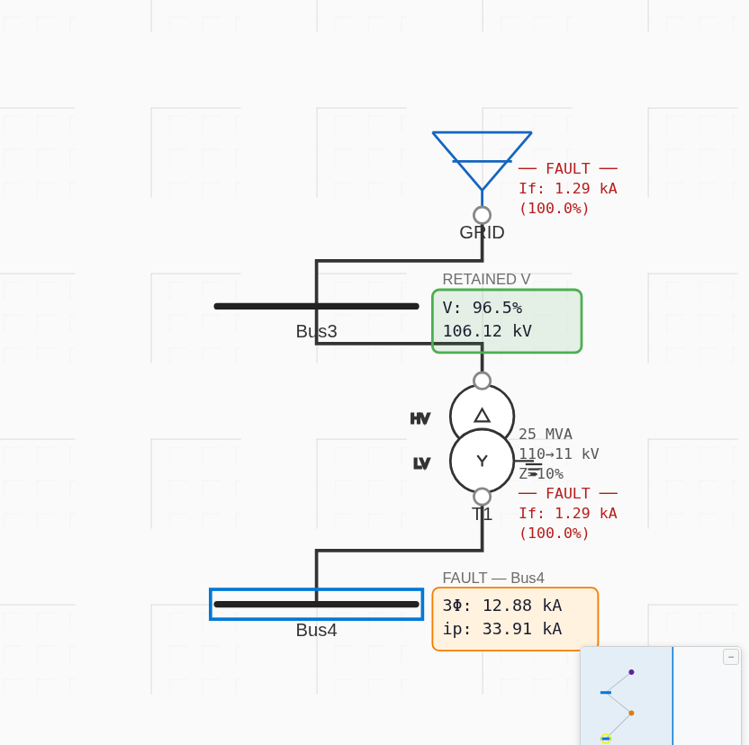
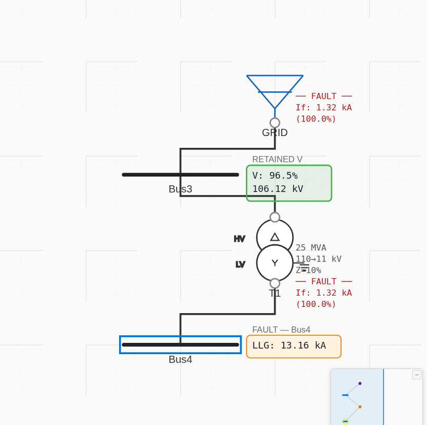

# Case 1 — No Load — Results

**Network:** GRID (40 kA @ 110 kV, X/R 14) → Bus3 (110 kV) → T1 (25 MVA, 110/11 kV, Z=10 %, X/R=20, Dyn11) → Bus4 (11 kV). **Fault at Bus4.**
**Model:** [`project.json`](project.json) · **Base:** 100 MVA · **Voltage factor:** c = 1.0 (to match ETAP; see PLAN decision 1).

## Impedances (ProtectionPro, 100 MVA base)
| Quantity | ProtectionPro | Article |
|---|---|---|
| Z1 (= Z2) | 0.020629 + j0.406964 p.u. | 0.02062867 + j0.40696407 |
| Z0 | \|Z0\| = 0.394367 (transformer only, grid blocked by Δ) | 0.01969377 + j0.39387544 (\|·\|=0.39437) |

Impedances reproduce the article to 5 significant figures — including the IEC 60909 transformer correction K_T = 0.98592.

## Fault currents vs ETAP (tolerance ±2 %)
| Fault | ETAP (kA) | ProtectionPro c=1.0 (kA) | Error | Verdict |
|---|---|---|---|---|
| 3-phase | 12.881 | 12.881 | 0.00 % | ✅ PASS |
| SLG | 13.021 | 13.020 | −0.01 % | ✅ PASS |
| LL | 11.155 | 11.155 | 0.00 % | ✅ PASS |
| LLG | 13.163 | 13.163 | 0.00 % | ✅ PASS |

Values are the authoritative direct-engine results; the app UI (screenshots below) agrees to within display rounding.

## Screenshots (real app, c = 1.0)
| Fault | Screenshot |
|---|---|
| 3-phase |  |
| SLG |  |
| LL |  |
| LLG |  |

## Notes
- Exact agreement — this baseline confirms the grid-feeder conversion, transformer K_T correction, and the 3-φ/SLG/LL/LLG sequence-network math are all correct.
- With the engine default c = 1.10, results are ~10 % higher (matching the article's separate "×1.1" column), as expected.
