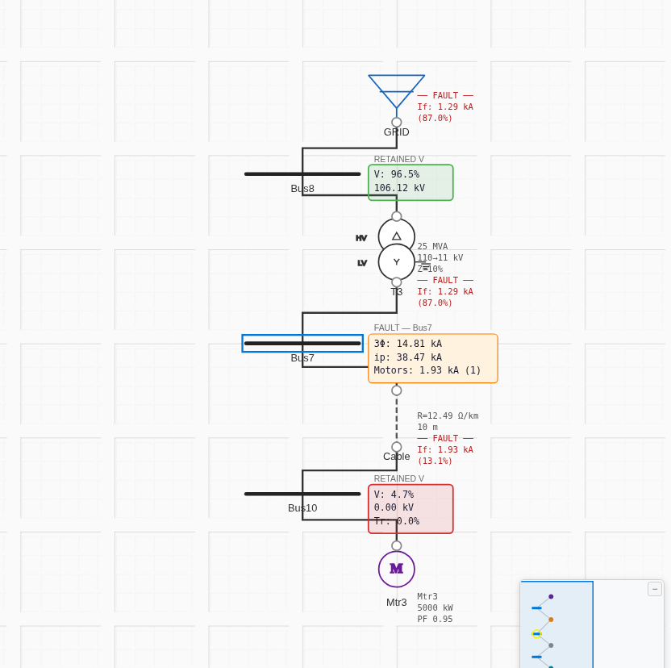
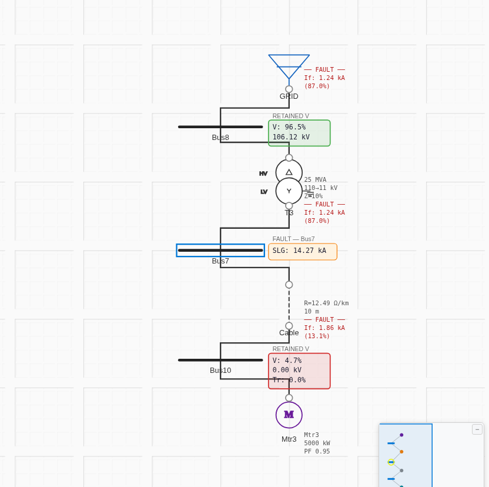

# Case 2 — With Motor Load — Results

**Network:** Case 1 + Cable8 (Cu, 10 m, R=0.098 Ω, X=0.09 Ω) → Bus10 → **Mtr3** (5 MW induction, 11 kV, η=90 %, PF=95 %, X″=0.15319 p.u., X/R=10.825). **Fault at Bus7 (11 kV).**
**Model:** [`project.json`](project.json) · **Base:** 100 MVA · **c = 1.0.**

> **Motor X/R:** the SLD annotates X/R = 35, but back-solving the article's own motor impedances (R = 0.01415, X″ = 0.15319 on motor base) gives **X/R = 10.825**, which is what its calculation actually used. We use 10.825. X/R barely affects \|Z\| (hence I″k); it mainly shifts the fault-current angle and peak.

## Fault currents vs ETAP (tolerance ±2 %)
| Fault | ETAP (kA) | ProtectionPro c=1.0 (kA) | Error | Verdict |
|---|---|---|---|---|
| 3-phase | 14.824 | 14.811 | −0.09 % | ✅ PASS |
| SLG | 14.282 | 14.274 | −0.06 % | ✅ PASS |
| LL | 12.837 | 12.827 | −0.08 % | ✅ PASS |
| LLG | 13.779 | 13.775 | −0.03 % | ✅ PASS |

### Source split (3-phase)
| Contribution | ETAP (kA) | ProtectionPro (kA) |
|---|---|---|
| Network (grid via T3) | 12.881 | 12.881 |
| Motor Mtr3 | 1.936 | 1.934 |

The motor sub-transient contribution (IEC 60909-0 §13) is reproduced to within 0.1 %.

## Screenshots (real app, c = 1.0)
| Fault | Screenshot |
|---|---|
| 3-phase |  |
| SLG |  |
| LL |  |
| LLG |  |

## Notes
- All four fault types and the motor/network split match ETAP within ±0.1 %.
- Z0 is unchanged from Case 1 (motor is not a zero-sequence source and the cable carries no Z0 to the fault), consistent with the article's identical Case 1/2 Z0.
