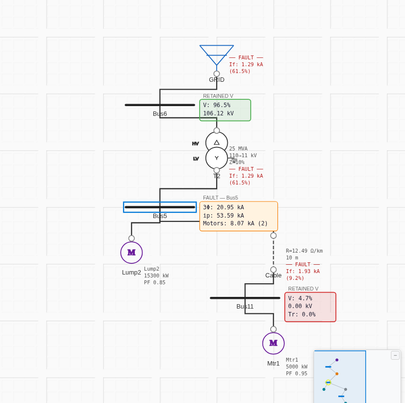
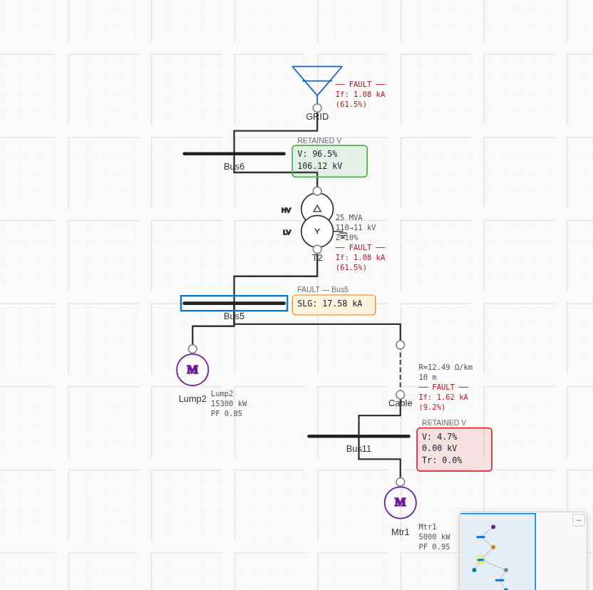
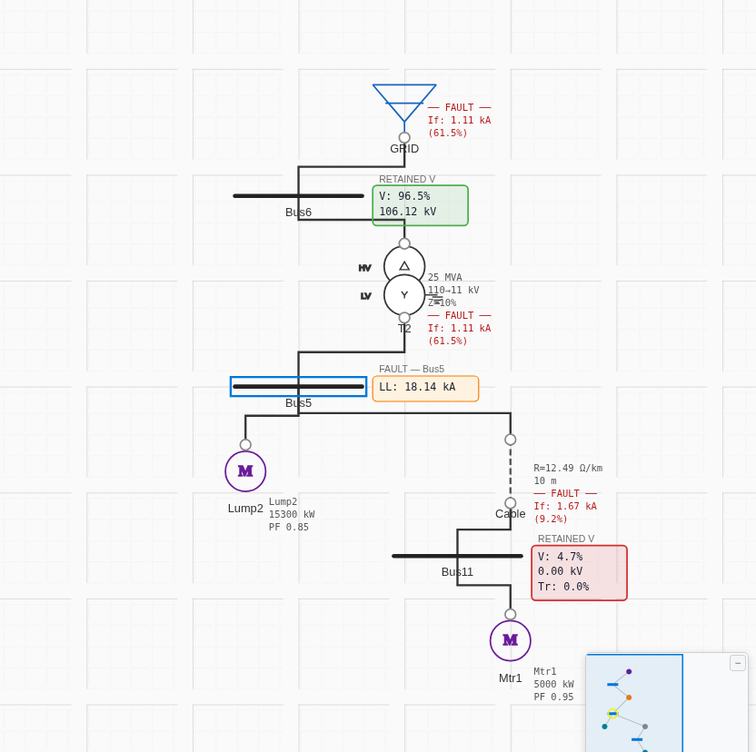

# Case 3 — Motor + Lump Load — Results

**Network:** GRID → Bus6 (110 kV) → T2 (25 MVA, Dyn11) → Bus5 (11 kV); at Bus5: **Lump2** (18 MVA, PF 0.85) and Cable21 → Bus11 → **Mtr1** (5 MW). **Fault at Bus5 (11 kV).**
**Base:** 100 MVA · **c = 1.0.**

The article models the 18 MVA lump as a **motor load** (a fault contributor, X″ = 15.31 %). ProtectionPro's `static_load` contributes **nothing** to fault. Per PLAN decision 3, Case 3 is run **both ways**.

## Variant A — lump modeled as induction motor  → [`project.json`](project.json)
| Fault | ETAP (kA) | ProtectionPro c=1.0 (kA) | Error | Verdict |
|---|---|---|---|---|
| 3-phase | 20.976 | 20.949 | −0.13 % | ✅ PASS |
| SLG | 17.597 | 17.585 | −0.07 % | ✅ PASS |
| LL | 18.165 | 18.142 | −0.13 % | ✅ PASS |
| LLG | 15.156 | 15.151 | −0.03 % | ✅ PASS |

Source split (3-φ): grid via T2 = 12.881 kA, motor + lump = 8.075 kA (article: 12.881 + [1.934 motor + 6.14 lump]). ✅

**Screenshots (real app, c = 1.0):**
| Fault | Screenshot |
|---|---|
| 3-phase |  |
| SLG |  |
| LL |  |
| LLG |  |

## Variant B — lump modeled as `static_load`  → [`project-lump-static.json`](project-lump-static.json)
| Fault | ETAP (kA) | ProtectionPro c=1.0 (kA) | Error | Verdict |
|---|---|---|---|---|
| 3-phase | 20.976 | 14.811 | **−29.4 %** | ❌ under-predicts |
| SLG | 17.597 | 14.274 | **−18.9 %** | ❌ under-predicts |
| LL | 18.165 | 12.827 | **−29.4 %** | ❌ under-predicts |
| LLG | 15.156 | 13.775 | **−9.1 %** | ❌ under-predicts |

Screenshots: `screenshots/*-static.png`. The static-load result collapses back to Case 2 (the lump is invisible to the fault engine).

## Discrepancy — qualified
This is **not an engine bug** but a **modeling convention**: IEC 60909-0 requires rotating loads that back-feed a fault to be represented as motors. ProtectionPro's `static_load` is a pure sink (correct for load-flow) and, by design, provides no sub-transient contribution.

**Guidance:** to reproduce ETAP-style fault studies, any lumped load with a significant motor component must be entered as an induction-motor equivalent (Variant A). This should be surfaced to users — logged to the backlog as a documentation/UX item.
