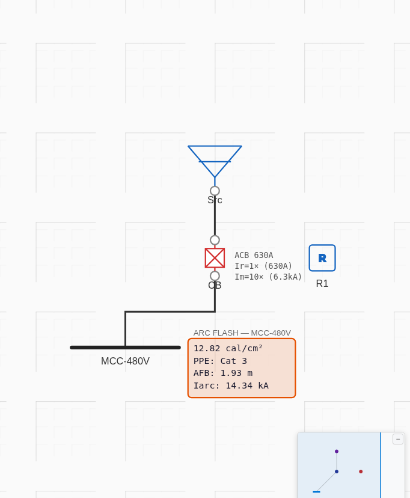

# Arc Flash (IEEE 1584-2002) — Results

**Method of verification:** standards-anchored hand calculation per **IEEE 1584-2002** — the same category the
project's own regression suite uses (`backend/tests/test_regression.py::TestArcFlash`, which anchors
`calc_incident_energy` to the 2002 equations). A clean, freely-available **third-party 2002 worked example**
(full inputs + published Ia/E) could not be found — current public material (elek.com, the ArXiv microgrid
paper, easypower/ETAP guides, toolgrit) uses the **2018** edition, whose arcing-current polynomial and
enclosure-size correction the engine deliberately does not implement. So each equation is worked by hand from
the published 2002 coefficients and the app is checked against it, both via the core functions and end-to-end
in the real app.

Inputs are chosen to fit the engine's model exactly (it auto-selects the conductor gap from voltage:
LV → 25 mm MCC/panel, x = 1.641; MV 2.4–4.16 kV → 102 mm, x = 0.973).

## Case A — 480 V MCC (Eq. 1, low-voltage arcing)
Inputs: V = 0.48 kV, Ibf = 25 kA, gap G = 25 mm, VCB (enclosed box), working distance D = 455 mm, arc
duration t = 0.2 s, ungrounded (K₂ = 0). Model: [`project.json`](project.json).

| Quantity | Equation | Hand-calc | App (direct) | App (end-to-end) |
|---|---|---|---|---|
| Arcing current Iₐ | Eq. 1 (K = −0.097) | 14.3441 kA | 14.3441 kA | 14.34 kA |
| Normalised energy Eₙ | Eq. 3 (K₁=−0.555) | 5.2828 J/cm² | 5.2828 J/cm² | — |
| Incident energy E | Eq. 4/5 (Cf=1.5, x=1.641) | 12.8199 cal/cm² | 12.8199 cal/cm² | 12.82 cal/cm² |
| Arc-flash boundary | E = 1.2 cal/cm² | 1927.0 mm | 1927.0 mm | 1927 mm |
| PPE category | NFPA 70E | Cat 3 | — | Cat 3 |

**Match: exact (0.000 %).** The end-to-end run built a 480 V bus fed via a CB tripped by a definite-time relay
(0.12 s + 0.08 s breaker = 0.20 s clearing) with the source tuned to a 25 kA bolted fault.

## Case B — 4.16 kV switchgear (Eq. 2, medium-voltage arcing)
Inputs: V = 4.16 kV, Ibf = 20 kA, gap 102 mm, VCB, D = 910 mm, t = 0.2 s (direct-function check).

| Quantity | Hand-calc | App (direct) | Diff |
|---|---|---|---|
| Iₐ (Eq. 2) | 19.1837 kA | 19.1837 kA | 0.000 % |
| E (Cf=1.0, x=0.973) | 5.9570 cal/cm² | 5.9570 cal/cm² | 0.000 % |
| AFB | 4722.8 mm | 4723.0 mm | 0.00 % |

## Screenshot (real app — on-canvas arc-flash badge)

Shows **12.82 cal/cm², PPE Cat 3, AFB 1.93 m, Iarc 14.34 kA** at the 480 V MCC — matching the hand-calc.

## Engine constraints found (not defects — documented for the backlog)
1. **Conductor gap is auto-selected from voltage, not user-settable.** LV is fixed at 25 mm (MCC/panel, x = 1.641),
   so the engine cannot model LV *switchgear* (32 mm, x = 1.473). Fine for this MCC case; a limitation for
   switchgear studies. → backlog: expose gap / equipment-class per bus.
2. **Clearing time is derived from upstream protection**, not entered directly — here engineered to 0.20 s via a
   definite-time relay. Faithful to the tool's design, but means reproducing a fixed-t textbook value needs a
   matching protective device.

## Verdict
ProtectionPro implements the **IEEE 1584-2002 arcing-current (Eq. 1 & 2), incident-energy (Eq. 3–5), and
arc-flash-boundary** calculations **exactly** — verified to 0.000 % against hand calculations across both the
LV and MV models, and reproduced end-to-end in the real app (correct gap, clearing time, energy, boundary, and
NFPA 70E PPE category).
