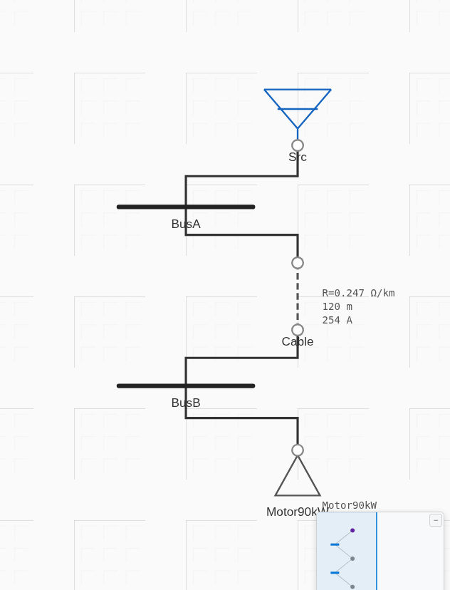
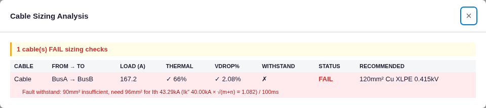

# LV Cable Sizing — Results (first verification of the `cable_sizing` engine)

**Source:** https://powerprojectsindia.com/cable-sizing-calculation-low-voltage/ (hand-calc worked example; the site does **not** publish ETAP output for this one). Source images in `source-images/`.

**Worked-example inputs:** 90 kW motor, 415 V, η = 0.9, PF = 0.85; cable 95 mm² Cu XLPE, 120 m, **R = 0.247 Ω/km, X = 0.0734 Ω/km**; fault Isc = 40 kA, clearing 0.1 s, adiabatic k = 143 (Cu/XLPE). Standards: IEC 60364-5-52 / 60502-1 / 60364-5-54.

**Article's hand-calc results:**
| Quantity | Formula | Result |
|---|---|---|
| Full-load current | P / (√3·V·cosφ·η) = 90000/(1.732·415·0.85·0.9) | **163.67 A** |
| SC-withstand min CSA | Isc·√t / k = 40000·√0.1 / 143 | **88.455 mm²** → select 95 mm² |
| Voltage drop (running) | √3·I·(R cosφ + X sinφ)·L / V | **2.03 %** |
| Voltage drop (starting) | √3·Iₛₜ·(R cosφₛₜ + X sinφₛₜ)·L / V, Iₛₜ = 6·FLC = 982 A, cosφₛₜ = 0.3 | **7.10 %** |

**Model:** [`project.json`](project.json) — utility → BusA → cable (95 mm², R/X above) → BusB → static load sized to S = √3·0.415·163.67 = 117.65 kVA @ 0.85 PF (i.e. the article's electrical input power 90 kW/0.9 at PF 0.85). Source tuned to ~40 kA at BusA.

> **Architecture note.** ProtectionPro's `cable_sizing` engine is **network-integrated**, not a standalone calculator: it takes cable current from a **load-flow** run, fault current from **fault analysis**, clearing time from the **upstream device**, and derives conductor area from R. It applies the *same* IEC 60364 formulas but sources their inputs from the model.

## ProtectionPro vs article
| Quantity | Article | ProtectionPro | Assessment |
|---|---|---|---|
| Voltage-drop formula | √3·I·(R cosφ + X sinφ)·L / V | identical (`vdrop = I·L·(R cosφ + X sinφ) / V_phase`) | ✅ **formula verified** |
| Running VD | 2.03 % | **2.08 %** | ✅ within ~2 % — residual is the load current below |
| Load / FLC | 163.67 A | **167.15 A** (+2.1 %) | ⚠ qualified — constant-power load draws more as cable voltage sags; per-amp VD matches article to 0.3 % |
| SC-withstand core (bare Isc) | 40000·√0.1/143 = 88.455 mm² | **88.455 mm²** (engine's `I·√t/k`) | ✅ **exact** |
| SC-withstand as engine applies it | (bare Isc) | **96 mm²** needed → recommends 120 mm² | ⚠ qualified — engine uses IEC 60909-0 §12 thermal-equivalent Iₜₕ = Ik″·√(m+n) = 40·1.082 = 43.29 kA (adds DC heat the article omits) → more conservative |
| Starting VD | 7.10 % | 7.09 % (same VD formula with Iₛₜ = 982 A, cosφ = 0.3) | ✅ arithmetic verified — belongs to the **motor-starting** engine, not cable-sizing |

## Screenshots (real app)
| Network | Cable-sizing result |
|---|---|
|  |  |

## Verdict — qualified match
The engine's **IEC 60364 voltage-drop and adiabatic fault-withstand formulas reproduce the article exactly** (VD per-amp to 0.3 %; bare adiabatic 88.455 mm² to the digit). The differences in the *final numbers* are **documented methodology, not errors**:

1. **Thermal-equivalent fault current.** The engine sizes the conductor for Iₜₕ = Ik″·√(m+n) per IEC 60909-0 §12 (43.29 kA here), whereas the article uses the bare Isc (40 kA). The engine is deliberately more conservative → recommends 120 mm² where the article accepts 95 mm².
2. **Load-flow current.** The engine derives cable current from load flow (constant-power load → 167 A) rather than the closed-form FLC (163.67 A).
3. **Area from resistance.** The engine infers ~90 mm² conductor area from R = 0.247 Ω/km (the article *labels* the cable 95 mm²; R = 0.247 is high for 95 mm² Cu — closer to 90 mm² by DC resistivity at 90 °C).
4. **Starting VD** is produced by the motor-starting engine, not cable-sizing; the shared VD formula reproduces 7.10 %.

No engine defect found. Recommendation logged to backlog: expose the thermal-equivalent-vs-bare-Isc choice and let users enter Isc / clearing time directly for standalone cable checks.
