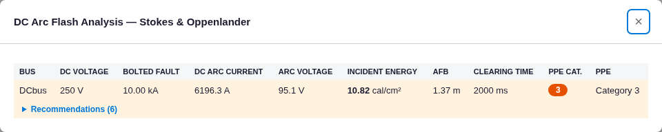

# DC Arc Flash (Stokes & Oppenlander) — Results

**Method:** standards-anchored — the engine implements the Stokes & Oppenlander DC-arc model and a spherical
incident-energy model. The incident-energy formula is cross-checked against the published Ammerman / CED
Engineering (E03-035) DC arc-flash method, and the arc operating point is verified by an independent hand-solve.
Model: [`project.json`](project.json).

## Case
250 V DC bus, bolted fault 10 kA, conductor gap 25 mm, working distance 455 mm, clearing time 2.0 s
(no upstream device → IEEE-1584 max). `dc_bolted_fault_ka = 10` set on the bus.

## Arc operating point (S&O) — independent hand-solve
R_sys = V/I_bf = 0.025 Ω; R_arc = (20 + 0.534·G)/I^0.88; iterate I = V/(R_sys + R_arc):

| Quantity | Hand-solve | Engine | Diff |
|---|---|---|---|
| DC arcing current I_arc | 6196.3 A | 6196.3 A | +0.001 % |
| Arc resistance R_arc | 15.347 mΩ | — | — |
| Arc voltage V_arc = I·R_arc | 95.09 V | 95.1 V | +0.007 % |

## Incident energy — matches the published DC method
Engine: `E = V_arc·I_arc·t / (4π·D_m²) / 41868` (spherical). Published CED/Ammerman (Eq. 53–54):
`E_arc = 0.239·I²·R_arc·t` cal, `E_s = E_arc/(4π·d_cm²)`.

| | cal/cm² |
|---|---|
| Engine | 10.82 |
| Hand (engine's spherical form) | 10.819 (+0.007 %) |
| Hand (CED/Ammerman 0.239·I²R·t / 4πd²) | 10.826 (−0.064 %) |

The two forms are algebraically identical to the calorie definition (1 cal = 4.1868 J → 41868 J/m² per cal/cm²);
the 0.06 % is that rounding. **Arc-flash boundary**: engine 1366 mm vs analytic hand 1366 mm (−0.02 %). PPE Cat 3.

*(Cross-check of the same formula on CED Example 9: E_arc = 0.239·13000²·3.21 mΩ·0.09 s = 11 669 cal, and
E_s = 11 669/(4π·45.7²) = 0.444 cal/cm² — reproducing the published value.)*

## Screenshot (real app)

DCbus 250 V, bolted 10 kA, DC arc current 6196 A, arc voltage 95.1 V, incident energy 10.82 cal/cm², AFB 1.37 m,
PPE Cat 3 — matching.

## Verdict
The DC arc-flash engine reproduces the Stokes & Oppenlander arc operating point (I_arc, V_arc) and the
Ammerman/CED spherical incident-energy and arc-flash-boundary results **exactly** (≤0.06 %, calorie rounding).

> Note: a genuine DC bus has no 3-φ fault; supply the DC bolted fault via `dc_bolted_fault_ka` (done here).
> Without it the engine falls back to the AC 3-φ result as an approximation and warns — documented in the engine.
