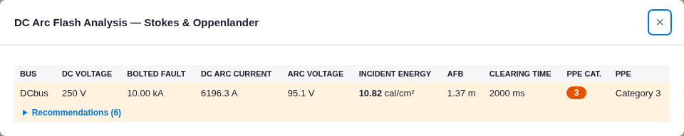

# DC Arc Flash (Stokes & Oppenlander) — Results

**Method:** standards-anchored — the engine implements the Stokes & Oppenlander DC-arc model and a spherical
incident-energy model. The incident-energy formula is cross-checked against the published Ammerman / CED
Engineering (E03-035) DC arc-flash method, and the arc operating point is verified by an independent hand-solve.
Model: [`project.json`](project.json).

## Case
250 V DC bus (System = DC) fed by a 250 V battery, bolted fault 10 kA entered on the bus (DC Fault Current),
conductor gap 25 mm, working distance 455 mm, open-air electrode configuration (VOA, as the reference),
clearing time 2.0 s (no upstream device → IEEE 1584 maximum).

## Arc operating point (S&O) — independent hand-solve
R_sys = V/I_bf = 0.025 Ω; R_arc = (20 + 0.534·G)/I^0.88; iterate I = V/(R_sys + R_arc):

| Quantity | Hand-solve | Engine | Diff |
|---|---|---|---|
| DC arcing current I_arc | 6196.3 A | 6196.3 A | +0.001 % |
| Arc resistance R_arc | 15.347 mΩ | — | — |
| Arc voltage V_arc = I·R_arc | 95.09 V | 95.1 V | +0.007 % |

## Incident energy — matches the published DC method
Engine: `E = V_arc·I_arc·t / (4π·D_m²) / 41840` (spherical, open air). Published CED/Ammerman (Eq. 53–54):
`E_arc = 0.239·I²·R_arc·t` cal, `E_s = E_arc/(4π·d_cm²)`.

| | cal/cm² |
|---|---|
| Engine | 10.83 |
| Hand (CED/Ammerman 0.239·I²R·t / 4πd²) | 10.826 |

The engine uses the thermochemical calorie (4.184 J, as the published 0.239 form, IEEE 1584 and NFPA 70E).
**Arc-flash boundary**: engine 1367 mm vs analytic hand 1366.7 mm. PPE Cat 3. In an enclosure (any
electrode configuration other than VOA/HOA) the energy is × 3, the NFPA 70E Annex D arc-in-a-box factor.

*(Cross-check of the same formula on CED Example 9: E_arc = 0.239·13000²·3.21 mΩ·0.09 s = 11 669 cal, and
E_s = 11 669/(4π·45.7²) = 0.444 cal/cm² — reproducing the published value.)*

## Screenshot (real app)

DCbus 250 V, bolted 10 kA, DC arc current 6196 A, arc voltage 95.1 V, incident energy 10.83 cal/cm², AFB 1.37 m,
PPE Cat 3 — matching.

## Verdict
The DC arc-flash engine reproduces the Stokes & Oppenlander arc operating point (I_arc, V_arc) and the
Ammerman/CED spherical incident-energy and arc-flash-boundary results **exactly**.

> Note: without an entered DC Fault Current the study takes the IEC 61660-1 quasi-steady short-circuit
> current of the DC short-circuit study for the bus.
