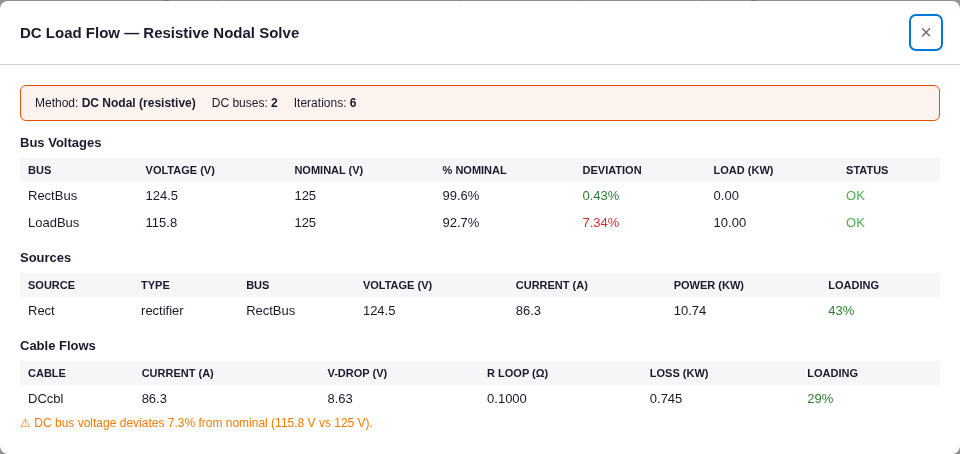

# DC Load Flow — Results

**Method:** first-principles exact circuit verification. DC load flow is a resistive nodal solve (Ohm's law +
constant-power loads), so the reference is an **exact hand solution of the same circuit** — no approximation is
involved. Model: [`project.json`](project.json).

## Circuit
Rectifier (125 V, 25 kW ⇒ I_rated = 200 A, regulation R_s = 0.01·V/I_rated = 6.25 mΩ) → DC cable
(loop R = 2·r·ℓ = 2·0.1·0.5 = 0.1 Ω) → load bus → **10 kW constant-power** DC load. Base return rail = 0 V.

## Exact nodal solution vs engine
Solving `V2 = E − (P/V2)·(R_loop + R_s)` (iterated) and `V1 = V2 + (P/V2)·R_loop`:

| Quantity | Exact hand-solve | Engine | Diff |
|---|---|---|---|
| Rectifier-bus voltage V1 | 124.460 V | 124.46 V | 0.00 % |
| Load-bus voltage V2 | 115.827 V | 115.83 V | +0.003 % |
| Load-bus drop | 7.34 % | 7.34 % | — |
| Cable current | 86.34 A | 86.34 A | +0.005 % |
| Cable loss (I²R) | 745.4 W | 745.4 W | 0.00 % |
| Rectifier output current | 86.34 A | 86.3 A | — |

**Exact agreement.** The engine correctly builds the conductance matrix (loop R = 2·r·ℓ two-wire), models the
rectifier as a Thévenin source (EMF behind R_s), linearises the constant-power load as I = P/V, and iterates to
convergence (6 iterations).

## Screenshot (real app)

RectBus 124.5 V (99.6 %), LoadBus 115.8 V (92.7 %, 7.34 % drop, correctly flagged > 5 %), rectifier 86.3 A /
10.74 kW / 43 % loaded, cable 86.3 A / 0.745 kW loss / 29 % loaded — matching the hand solve.

## Verdict
ProtectionPro's DC load flow reproduces the exact resistive-circuit solution to **≤0.005 %** (voltages,
currents, losses), and end-to-end in the real app.

> Note: `project.json` carries `dataVersion: 2` so the frontend treats the cable `r_per_km` as already at
> operating temperature (without it, the frontend's legacy-migration would scale the resistance and shift the
> drop — same behaviour documented for cable sizing).
