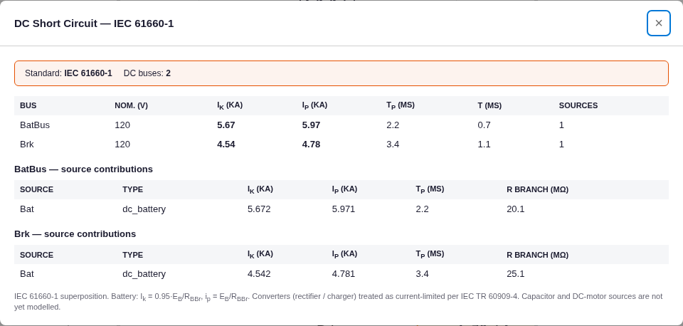

# DC Short Circuit (IEC 61660-1) — Results

**Anchor:** the published worked example in *Arc Flash Hazard Calculations in DC Systems* (CED Engineering
E03-035), "Example 1" — a **60-cell 120 V, 200 Ah lead-acid battery** (R_B = 18.6 mΩ, connectors 1.498 mΩ)
feeding a breaker through a 5 mΩ / 14 µH cable. Published IEC 61660-1 result at the breaker:
**peak i_pB = 5422 A, quasi-steady-state I_kB = 4796 A, τ = 1.3 ms.** Model: [`project.json`](project.json).

The engine implements a **simplified** IEC 61660-1 (per its docstring): battery `I_k = 0.95·E_B/R_BBr`,
`i_p = E_B/R_BBr`, `τ = L_BBr/R_BBr`, with `R_BBr = R_internal + effective network R` (Laplacian
pseudo-inverse), and converters current-limited per IEC TR 60909-4. It omits the standard's refinements: the
**0.9 factor on R_B** (peak), **E_B = 1.05·U_nB** (EMF), the **+0.1·R_B** term in I_k, and the **T_B = 30 ms**
battery time constant in τ.

## Battery — core computation is exact
Feeding the engine the **standard's preprocessed peak inputs** (E_B = 1.05·120 = 126 V; 0.9·R_B + connectors =
0.9·18.6 + 1.498 = 18.238 mΩ; + 5 mΩ cable ⇒ R_BBr = 23.238 mΩ):

| Quantity | Published (IEC 61660) | Engine | Diff |
|---|---|---|---|
| Peak i_pB | 5422 A | **5422 A** | **0.00 %** |

→ the engine's core `E_B / R_BBr` + network-resistance + superposition math reproduces the published peak
**exactly**.

## Battery — raw physical inputs (documents the simplification gap)
Feeding the **raw** physical inputs (E_B = 120 V nominal; R_B + connectors = 20.098 mΩ; + 5 mΩ cable):

| Quantity | Published | Engine (raw) | Diff |
|---|---|---|---|
| Peak i_pB | 5422 A | 4781 A | **−11.8 %** |
| Quasi-steady I_kB | 4796 A | 4542 A | −5.3 % |
| Rise time constant τ | 1.3 ms | 1.14 ms | −12 % |

The engine reads **~5–12 % low** because it does not apply the 0.9·R_B (peak), 1.05·U_nB (EMF), +0.1·R_B (I_k)
or T_B (τ) factors. This is **non-conservative** for battery peak current — flagged as a backlog enhancement.

## Converter (charger) — exact
Charger rated 200 A, default DC short-circuit factor 1.5 (IEC TR 60909-4):

| Quantity | Expected | Engine |
|---|---|---|
| I_k = factor × I_rated | 300 A | 300 A ✅ |
| i_p = 1.05 × I_k | 315 A | 315 A ✅ |

## Screenshot (real app)

Fault at the battery bus (no cable, R_BBr = 20.1 mΩ): i_p 5.97 kA / I_k 5.67 kA; at the breaker (with cable,
25.1 mΩ): i_p 4.78 kA / I_k 4.54 kA — matching the raw-input hand-calc. Footer states the IEC 61660-1
superposition method and the current-limited-converter treatment.

## Verdict
The engine's DC short-circuit computation is **correct for its (documented, simplified) model**: the
converter current-limit is exact, the battery `E_B/R_BBr` + network-resistance + superposition reproduces the
published IEC 61660 peak **exactly (0.00 %)** when given the standard's preprocessed inputs. Fed raw physical
inputs it under-estimates the battery fault current by ~5–12 % because it omits the 0.9·R_B / 1.05·U_nB /
+0.1·R_B / T_B refinements. **Recommended enhancement (backlog):** apply these IEC 61660-1 factors internally
so raw nameplate inputs give the full-standard (conservative) result.
