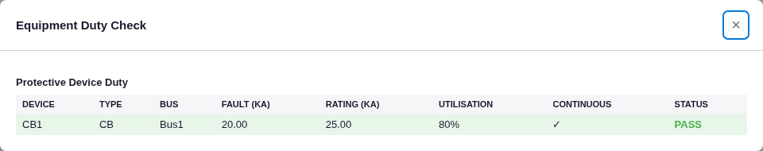

# Equipment Duty Check — Results

**Method:** the duty check is a comparison layer over the (already-verified) IEC 60909 fault engine and the
load flow — it derives the prospective fault, peak, and making duties and compares them to device ratings. Each
derived quantity is checked by hand. Model: [`project.json`](project.json).

## Case
Utility (6.6 kV, tuned to I″k3 = 20 kA, X/R = 10) → Bus1 → CB1 (VCB, breaking capacity 25 kA, rated 1250 A,
7.2 kV).

## Verification
| Quantity | Formula | Hand-calc | Engine | Diff |
|---|---|---|---|---|
| Prospective fault I″k3 | fault engine | 20.00 kA | 20.00 kA | 0.00 % |
| Breaking duty | Ib (IEC 60909 §9), else I″k3 | 20.00 kA (Ib) | 20.00 kA | 0.00 % |
| Peak fault ip | κ·√2·I″k3 (κ = 1.746) | 49.38 kA | 49.38 kA | −0.01 % |
| Making capacity | 2.5 × Icu (MV, IEC 62271-100, 50 Hz) | 62.5 kA | 62.5 kA | 0.00 % |
| Utilisation | Ib / Icu | 80.0 % | 80.0 % | 0.00 % |
| Verdict | interrupt ✓, making ✓ (ip 49.4 ≤ 62.5) | PASS | PASS | ✓ |

Also confirmed the LV making-capacity path (IEC 60947-2 Table 2 ratios n = 1.5–2.2 by Icu) and the transformer
overload check exist in the engine; the MV 2.5× factor is exercised here.

## Screenshot (real app)

CB1 on Bus1: Fault 20.00 kA, Rating 25.00 kA, Utilisation 80 %, Continuous ✓, **PASS** — matching.

## Verdict
The duty check reproduces the peak-current (κ·√2·I″k), making-capacity (2.5·Icu MV per IEC 62271-100), and
breaking-duty comparisons **exactly**, on top of the already-verified fault engine.
