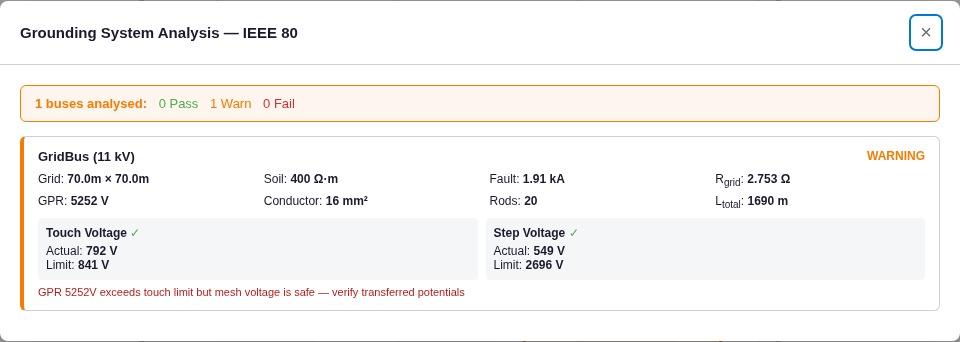

# Grounding System (IEEE 80) — Results

**Method:** standards-anchored hand calculation per **IEEE Std 80** (as with arc flash — no freely-available
third-party worked example publishes every intermediate quantity; the standard's Annex B is paywalled). Each
IEEE 80 equation is worked by hand — using the **full** `n` and `L_M` formulas from the standard — and the app
is checked against it, both via the core sub-functions and end-to-end in the real app. The project's own
regression suite already anchors the conductor-sizing equation (IEEE 80 Eq. 37) to a hand value.

A **square grid with ground rods** is used so the engine's simplified `n = max(n_x, n_y)` equals IEEE 80's
`n = n_a` (for a square grid n_a = n_x, with n_b = n_c = n_d = 1) and so the engine's `K_ii = 1.0` is the
correct value (grids with rods along the perimeter use K_ii = 1.0).

## Inputs (IEEE 80-typical)
ρ = 400 Ω·m; crushed rock ρ_s = 2500 Ω·m, h_s = 0.102 m; grid **70 m × 70 m** (A = 4900 m²), burial h = 0.5 m;
11 × 11 conductors @ D = 7 m; conductor d = 0.01 m, hard-drawn copper; **20 ground rods** × 7.5 m;
t_s = t_c = 0.5 s; T_a = 40 °C; 70 kg body; earth-fault I_G = 1908 A. Model: [`project.json`](project.json).

## App vs full IEEE 80 hand-calc
| Quantity | IEEE 80 hand-calc | App (sub-fn) | App (end-to-end) | Match |
|---|---|---|---|---|
| Surface derating C_s (Eq. 27) | 0.7429 | 0.7429 | 0.7429 | ✅ exact |
| Tolerable touch E_touch70 (Eq. 32) | 840.5 V | 840.5 V | 841 V | ✅ exact |
| Tolerable step E_step70 (Eq. 33) | 2696.1 V | 2696.1 V | 2696 V | ✅ exact |
| Grid resistance R_g (Sverak Eq. 57) | 2.7526 Ω | 2.7526 Ω | 2.753 Ω | ✅ exact |
| Ground potential rise GPR | 5252 V | — | 5252 V | ✅ exact |
| Spacing factor K_m (Eq. 86) | 0.7717 | 0.7717 | — | ✅ exact |
| Spacing factor K_s (Eq. 94) | 0.4061 | 0.4061 | — | ✅ exact |
| Irregularity K_i (Eq. 89) | 2.2720 | 2.2720 | — | ✅ exact |
| Step voltage E_s (Eq. 92) | 549.1 V | 549.1 V | 549 V | ✅ exact |
| Decrement factor D_f (Eq. 79) | 1.00 | — | 1.00 | ✅ exact |
| Min conductor (Onderdonk Eq. 37) | 4.82 mm² → 16 mm² | 4.82 mm² | 4.8 → 16 mm² | ✅ exact |
| **Mesh (touch) voltage E_m (Eq. 85)** | **749.1 V** | 791.8 V | 792 V | ⚠ **+5.7 %** |

## The one difference — mesh voltage E_m (qualified, conservative)
The engine uses a **simplified effective length** `L_M = L_c + L_rod` (= 1690 m). IEEE 80 Eq. 88 for a grid
**with rods** uses `L_M = L_c + [1.55 + 1.22·(L_r / √(L_x²+L_y²))]·L_R` (= 1786 m). Because the engine's L_M is
smaller, its mesh voltage is **5.7 % higher** (792 V vs 749 V) — i.e. **conservative** (it overstates the touch
voltage, erring on the safe side). Everything E_m depends on except L_M (ρ, I_G, K_m, K_i) matches exactly.

## Screenshot (real app)

Shows R_grid 2.753 Ω, GPR 5252 V, touch 792 V ≤ 841 V ✓, step 549 V ≤ 2696 V ✓, 16 mm² conductor — matching.

## Applicability / engine limitations (documented, backlog)
1. **`n = max(n_x, n_y)`** equals IEEE 80's `n` only for **square** grids; for rectangular/L-shaped grids the
   full `n = n_a·n_b·n_c·n_d` differs (this is why the standard's rectangular Annex-B example would not match `n`).
2. **`K_ii = 1.0`** is correct for grids **with rods**; grids **without rods** need `K_ii = 1/(2n)^(2/n)`.
3. **`L_M`** omits the rod-length weighting of Eq. 88 → mesh voltage conservative by a few percent when rods
   are present.

## Verdict
ProtectionPro reproduces the IEEE 80 tolerable voltages, surface derating, grid resistance, GPR, geometric
factors (K_m/K_s/K_i), step voltage, decrement factor, and conductor sizing **exactly (0.000 %)** for a square
grid with rods, and end-to-end in the real app. The sole divergence is the **mesh (touch) voltage, +5.7 %** and
**conservative**, from a documented simplification of the effective buried length L_M. Recommended enhancement
(backlog): implement the full IEEE 80 `n` and `L_M` (and no-rods `K_ii`) so mesh voltage and non-square /
no-rods grids match exactly.
