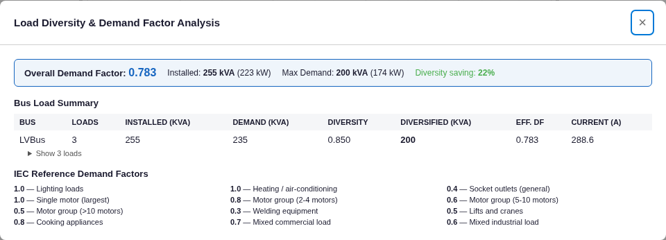

# Load Diversity & Demand Factor — Results

**Method:** deterministic demand aggregation (per-load demand factor + IEC 60439 group coincidence factor Ks).
Verified by exact hand calculation. Model: [`project.json`](project.json).

## Case (0.4 kV bus, 3 loads)
| Load | Rating | PF | Demand factor | Installed kVA | Demand kVA |
|---|---|---|---|---|---|
| L1 (static) | 100 kVA | 0.90 | 0.8 | 100.00 | 80.00 |
| L2 (static) | 50 kVA | 0.85 | 1.0 | 50.00 | 50.00 |
| M1 (induction) | 90 kW, η 0.95 | 0.90 | 1.0 | 105.26 (= 90/0.95/0.9) | 105.26 |

## Verification
| Quantity | Hand-calc | Engine | Diff |
|---|---|---|---|
| Bus installed kVA | 255.26 | 255.26 | 0.00 % |
| Bus demand kVA (pre-Ks) | 235.26 | 235.26 | 0.00 % |
| Group coincidence Ks (n = 3, IEC table interp.) | 0.850 | 0.850 | 0.00 % |
| Diversified demand kVA | 199.97 | 199.97 | 0.00 % |
| Effective demand factor | 0.783 | 0.783 | 0.00 % |
| Demand current @ 0.4 kV | 288.6 A | 288.6 A | 0.00 % |
| Motor input kVA (kW/η/PF) | 105.263 | 105.26 | 0.00 % |

## Screenshot (real app)

Overall demand factor 0.783, installed 255 kVA, diversified max demand 200 kVA (22 % diversity saving), demand
current 288.6 A — matching.

## Verdict
The load-diversity engine reproduces the per-load demand, IEC group coincidence factor, diversified demand,
effective demand factor, and demand current **exactly**.
