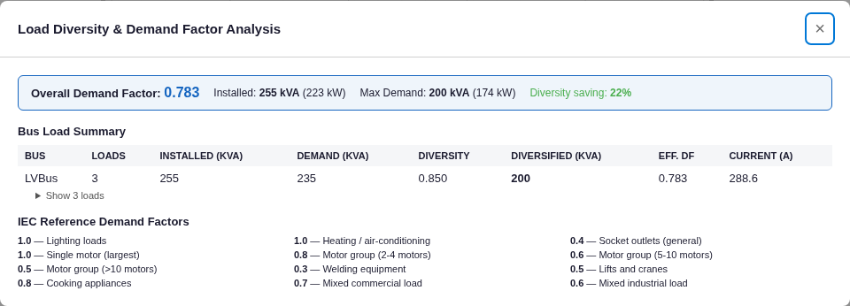

# Load Diversity & Demand Factor — Results

**Method:** deterministic demand aggregation — per-load demand factor, loads added as kW and kvar (the load
flow's convention), IEC 61439 rated diversity factor Ks for the number of circuits on the board.
Verified by exact hand calculation. Model: [`project.json`](project.json).

## Case (0.4 kV bus, 3 loads)
| Load | Rating | PF | Demand factor | Installed kVA | Demand kW | Demand kvar |
|---|---|---|---|---|---|---|
| L1 (static) | 100 kVA | 0.90 | 0.8 | 100.00 | 72.00 | 34.87 |
| L2 (static) | 50 kVA | 0.85 | 1.0 | 50.00 | 42.50 | 26.34 |
| M1 (induction) | 90 kW, η 0.95 | 0.90 | 1.0 | 105.26 (= 90/0.95/0.9) | 94.74 | 45.88 |

## Verification
| Quantity | Hand-calc | Engine | Diff |
|---|---|---|---|
| Bus installed kVA | 255.26 | 255.26 | 0.00 % |
| Σ demand kW / kvar | 209.24 / 107.09 | 209.24 / 107.09 | 0.00 % |
| Bus demand kVA (pre-Ks), \|ΣP + jΣQ\| | 235.05 | 235.05 | 0.00 % |
| Coincidence factor Ks (n = 3, IEC 61439: 2–3 circuits) | 0.900 | 0.900 | 0.00 % |
| Diversified demand kVA | 211.55 | 211.55 | 0.00 % |
| Effective demand factor | 0.829 | 0.829 | 0.00 % |
| Demand current @ 0.4 kV | 305.3 A | 305.3 A | 0.00 % |

The demand kW (209.24) equals the load flow's load on the same bus.

Re-baselined 2026-10-01 (load diversity review LD5, LD6): Ks was 0.85 from an interpolated table of unknown
source, and the kVA was the arithmetic sum of the loads' kVA (235.26); diversified demand was 199.97 kVA,
288.6 A. The screenshot below predates the change.

## Screenshot (real app)

## Verdict
The load-diversity engine reproduces the per-load demand, IEC 61439 coincidence factor, diversified demand,
effective demand factor and demand current **exactly**.
