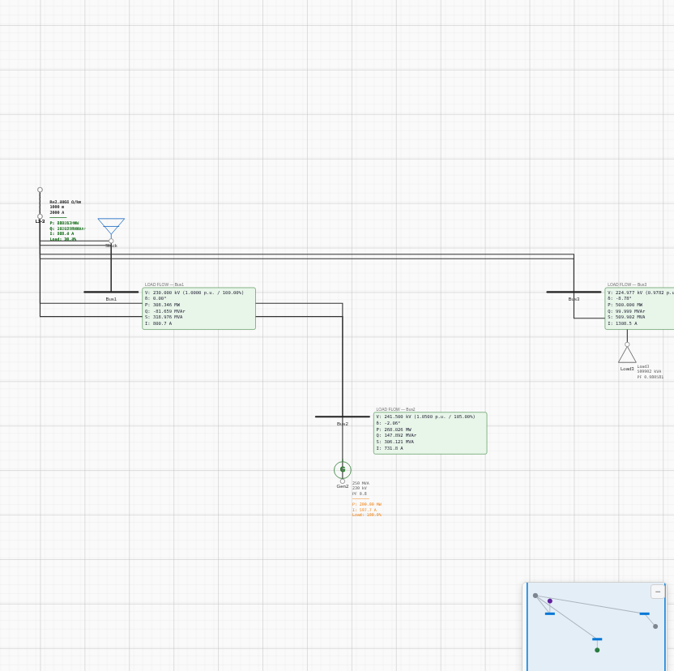

# 3-Bus Load Flow (Newton-Raphson) — Results

**Source:** Prof. K. Webb, *ESE 470 — Energy Distribution Systems, Section 5: Power Flow*, Oregon State University
(course notes based on Glover, *Power System Analysis & Design*). Worked "Power-Flow Solution" example, slides 107–123.
Reference solution slide: [`reference/ese470-solution-slide.png`](reference/ese470-solution-slide.png).
Chosen because it is **fully self-contained** (complete bus + line data and a published converged solution) and fits
ProtectionPro's load-flow model: a **slack at 1.0 pu**, one PV and one PQ bus, and **series-impedance lines with no
line charging**.

## The example (per-unit, 100 MVA base)
| Bus | Type | Specified | 
|---|---|---|
| 1 | Slack | V = 1.00 ∠0° |
| 2 | PV | P = 2.0 pu, \|V\| = 1.05 |
| 3 | PQ | P = −5.0 pu, Q = −1.0 pu |

Lines (series only — verified charging-free: Y₁₁ = y₁₂ + y₁₃ exactly), reconstructed from the notes' Y-bus:
- Line 1-2 = Line 2-3: y = 2.06 − j20.9 pu → **z = 0.004625 + j0.047394 pu**
- Line 1-3: y = 1.54 − j15.7 pu → **z = 0.006232 + j0.063089 pu**

**Model:** [`project.json`](project.json). Built at a single 230 kV level (z_base = 230²/100 = 529 Ω): lines entered as
L1-2/L2-3 = 2.447 + j25.07 Ω, L1-3 = 3.297 + j33.37 Ω. Slack = utility; PV bus = must-run generator with
`voltage_setpoint_pu = 1.05`; PQ bus = 509.902 kVA static load at 0.98058 PF (= 500 kW + j100 kvar). Newton-Raphson.

## ProtectionPro vs published solution
| Quantity | Reference | ProtectionPro (NR) | Diff |
|---|---|---|---|
| Iterations to converge | 4 | 4 | — |
| V₂ (PV) | 1.050 ∠−2.1° | 1.0500 ∠−2.06° | 0.00 / 0.04° |
| V₃ (PQ) | 0.98 ∠−8.8° (0.97 in the notes' vector) | 0.9782 ∠−8.78° | ≤0.002 pu / 0.02° |
| Slack P₁ | 3.08 pu | 3.0835 pu (308.35 MW) | 0.1 % |
| Slack Q₁ | −0.82 pu | −0.8166 pu (−81.66 Mvar) | 0.4 % |
| Gen P₂ | 2.0 pu | 2.000 pu (200.0 MW) | 0.0 % |
| Load S₃ | −5.0 − j1.0 pu | 500.0 MW + j99.999 Mvar | 0.0 % |

**All bus voltages, angles, slack power, and the iteration count match the published solution** to within the
2–3 significant figures the notes report (worst case 0.4 % on slack Q). ✅ PASS (tolerance ±2 %).

## Screenshot (real app, Newton-Raphson)

## Note — PV-bus generator reactive display
The published solution has the PV generator supplying **Q₂ = +2.67 pu (267 Mvar)** to hold V₂ = 1.05. ProtectionPro's
solver does inject this — **proven** by V₂ holding exactly 1.0500 and the slack Q matching (−81.66 vs −82). However,
the on-canvas **generator badge shows the machine's *scheduled* reactive (capped at its MVA rating), not the
solver-computed PV reactive** — a cosmetic reporting detail that does not affect the solution. Logged to the backlog.

## Verdict
ProtectionPro's Newton-Raphson load flow **reproduces the textbook solution essentially exactly** (voltages/angles to
≤0.002 pu / 0.04°, powers to ≤0.4 %, same 4-iteration convergence). This is the first verification of `loadflow.py`,
and it passes cleanly on a self-contained, charging-free slack + PV + PQ example.
