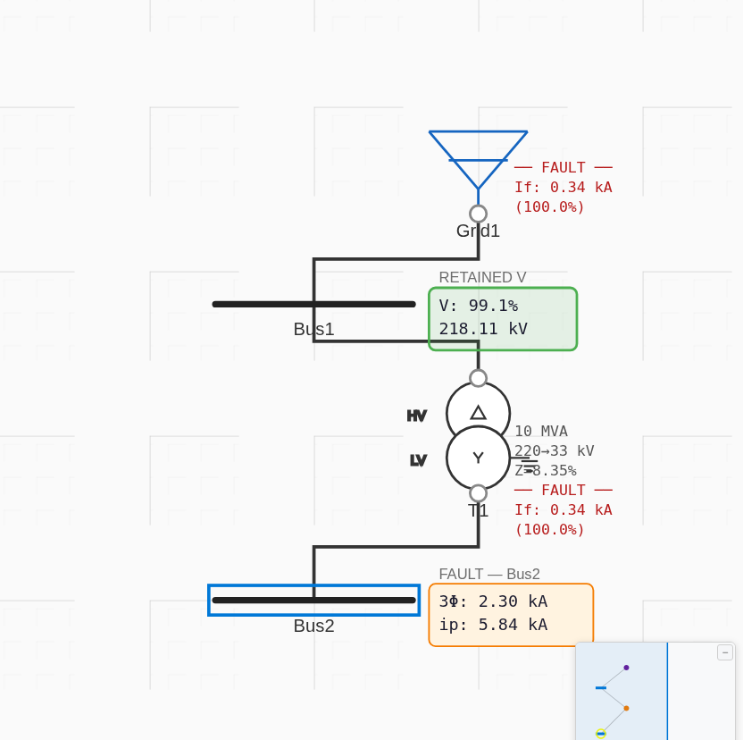
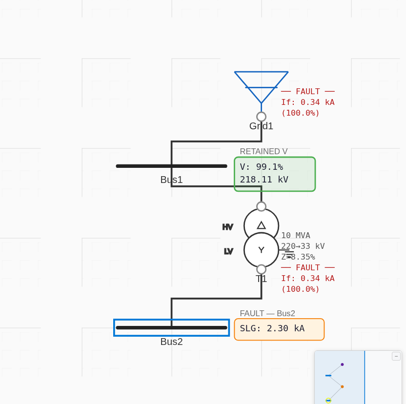

# SC-2 — 220/33 kV Short Circuit — Results

**Source:** https://powerprojectsindia.com/short-circuit-calculation-symmetrical-and-asymmetrical-fault-current/
(a second, distinct short-circuit worked example — different network from the main 3-case study). Source images archived in `source-images/`.

**Network:** Grid1 (15242.047 MVAsc @ 220 kV, X/R=10) → Bus1 (220 kV) → **T1 (10 MVA, 220/33 kV, Z=8.35 %, X/R=13, Dyn1)** → Bus2 (33 kV). **Fault at Bus2.**
**Model:** [`project.json`](project.json) · **Base:** 100 MVA.

## This article publishes ETAP one-line screenshots (Bus2, 33 kV)
| Fault | ETAP screenshot | Article hand-calc (c=1.0) | Article ×1.1 |
|---|---|---|---|
| 3-phase | **2.296 kA** ∠−85.59° | 1.9675 | 2.1643 |
| SLG | **2.302 kA** | 2.01376 | 2.2151 |
| LL | **1.988 kA** | 1.701 | 1.8711 |
| LLG | **2.309 kA** | 2.0658 | 2.27245 |

The ETAP screenshots were run with **c = 1.10** (cmax). Note: unlike the main 3-case article (whose ETAP used c = 1.0), this article's ETAP used the default cmax = 1.10 — so ProtectionPro's **default** reproduces it directly.

## ProtectionPro vs ETAP (tolerance ±2 %)
Impedances (100 MVA base): Z1 = Z2 = 0.06439 + j0.83514 (|Z1| = 0.83762); |Z0| = 0.83106 (transformer only — grid blocked by the Dyn delta). i_base(100 MVA, 33 kV) = 1.7496 kA.

| Fault | ETAP (kA) | ProtectionPro c=1.10 (kA) | Error | Verdict |
|---|---|---|---|---|
| 3-phase | 2.296 | 2.296 | 0.00 % | ✅ PASS |
| SLG | 2.302 | 2.302 | 0.00 % | ✅ PASS |
| LL | 1.988 | 1.988 | 0.00 % | ✅ PASS |
| LLG | 2.309 | 2.309 | 0.00 % | ✅ PASS |

**Exact agreement with ETAP on all four fault types.** (At c = 1.0, ProtectionPro gives 2.089 / 2.094 / 1.809 / 2.100 kA.)

## Screenshots (real app, c = 1.10)
| Fault | Screenshot |
|---|---|
| 3-phase |  |
| SLG |  |
| LL |  |
| LLG |  |

## ⚠ Discrepancy found — in the article, not the app
The article's **hand-calculations are ~15 % low** and do **not** match its own ETAP screenshots (e.g. 3-φ hand-calc 1.97 kA vs ETAP 2.296 kA). Cause: the hand-calc **mixes per-unit bases** — the grid impedance is expressed on a 100 MVA base (Zs = 0.00656 p.u.) while the transformer impedance is left on its own 10 MVA base (Zt = 0.08233 p.u.), and the two are added directly (Z1 = 0.08889). Converting both to a common base (transformer → 0.8234 p.u. on 100 MVA, or grid → 0.000656 p.u. on 10 MVA) gives |Z1| ≈ 0.838 and I″k3 ≈ 2.09 kA at c = 1.0 / 2.30 kA at c = 1.1.

**ETAP and ProtectionPro both handle the base conversion correctly and agree exactly.** This example therefore doubly validates ProtectionPro: it matches the reference software *and* exposes an arithmetic error in the published hand-calc.
