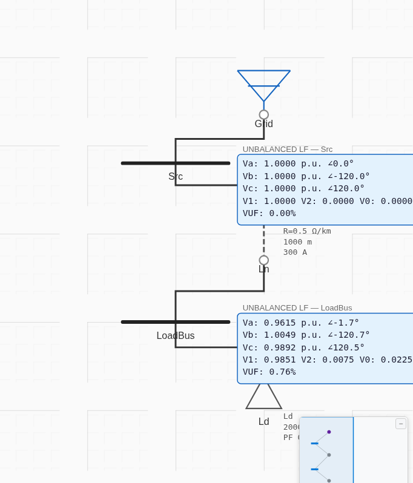

# Unbalanced Load Flow (Symmetrical Components) — Results

**Method:** the engine solves the positive sequence via Newton-Raphson (the already-verified balanced solver),
and the negative/zero sequences as linear injections from the per-phase load unbalance, then reconstructs
`[Va,Vb,Vc] = A·[V0,V1,V2]` and reports VUF = |V2|/|V1|. Verified by a balanced-limit check, a positive-sequence
anchor to the balanced load flow, the exact phase↔sequence transform, and the VUF definition. A full IEEE 13-bus
abc-frame comparison is out of scope — this is a simplified sequence-based unbalanced LF, not a multi-phase
distribution solver with regulators/laterals. Model: [`project.json`](project.json).

## Case
Utility (11 kV swing) → line (Z1 = 0.5+j1.0, Z0 = 1.5+j3.0 Ω/km) → load bus → 2000 kVA / 0.9 PF static load.

## Balanced-limit check (phase split 33.33 / 33.33 / 33.34)
| Quantity | Result |
|---|---|
| Va, Vb, Vc | 0.98508 / 0.98507 / 0.98506 pu (equal) |
| V2, V0 | 2×10⁻⁶, 6×10⁻⁶ (≈ 0) |
| VUF | 0.0002 % (≈ 0) ✅ |

→ the sequence machinery correctly collapses to the balanced solution when the load is balanced.

## Unbalanced case (phase split 60 / 20 / 20)
| Quantity | Engine |
|---|---|
| Va | 0.96146 ∠−1.75° |
| Vb | 1.00489 ∠−120.72° |
| Vc | 0.98922 ∠+120.47° |
| V1 / V2 / V0 | 0.98507 / 0.00750 / 0.02251 pu |
| VUF | 0.7618 % |

| Check | Result |
|---|---|
| VUF = \|V2\|/\|V1\| | 0.00750/0.98507 = **0.7618 %** = engine (exact) |
| Phase↔sequence transform: A⁻¹·[Va,Vb,Vc] | \|V0\|=0.02251, \|V1\|=0.98507, \|V2\|=0.00750 — **matches reported V0/V1/V2 exactly** |
| Positive-sequence anchor: V1 vs balanced LF \|V\| | 0.98507 vs 0.98507 — **+0.000 %** |

## Screenshot (real app — on-canvas per-phase badges)

Src bus (swing): Va=Vb=Vc=1.0000, VUF 0.00 %. LoadBus: Va 0.9615∠−1.7°, Vb 1.0049∠−120.7°, Vc 0.9892∠+120.5°,
V1 0.9851 / V2 0.0075 / V0 0.0225, VUF 0.76 % — matching.

## Verdict
The unbalanced load flow is verified: it collapses to the exact balanced solution when balanced, its positive
sequence **exactly equals the verified Newton-Raphson balanced load flow**, the phase↔sequence (A / A⁻¹)
transform is internally exact, and VUF = |V2|/|V1| is exact. (A full IEEE 13-bus feeder — voltage regulators,
single-phase laterals, distributed loads — exceeds this simplified sequence-based engine's model and was not
attempted.)
