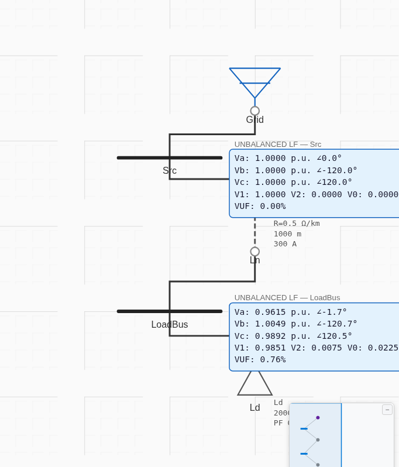

# Unbalanced Load Flow (Symmetrical Components) — Results

**Method:** the engine iterates the three sequence networks to a consistent solution: phase voltages from the
latest V0/V1/V2 → each constant-power load's phase currents at those voltages → I0/I1/I2 → Y2·V2 = I2, Y0·V0 = I0,
and the loads' positive-sequence power V1·conj(I1) fed back into the Newton-Raphson positive-sequence solve, until the
sequence voltages stop moving. It then reports `[Va,Vb,Vc] = A·[V0,V1,V2]` and VUF = |V2|/|V1|.

**Independent reference (2026-10-01):** the same feeder solved directly in the **phase domain**. The line's phase
impedance matrix is Zabc = A·diag(Z0, Z1, Z1)·A⁻¹. The 200 MVA source is a positive-sequence EMF behind its own
Zs,abc (Z1 = Z2 = Z0 = U²/S″k, X/R 10), with the EMF scaled so the source bus holds |V1| = 1 p.u. (the engine's swing
convention). The load's phase currents are iterated to a fixed point in phases. There are no sequence networks and no
Newton-Raphson, so it shares no code with the engine. Engine and reference agree to every reported digit.

**Correction:** before 2026-09-28 the engine solved the sequences in a single pass, with load currents taken at phase
voltages *assumed balanced*. On this case it reported VUF 0.7618 % and Va 0.96146 pu. The phase-domain solve gives
**0.8045 %** and **0.95967 pu**: the old answer understated the unbalance by ~5 % and was optimistic on the loaded
phase. The earlier "V1 equals the balanced load flow exactly" check was a symptom of the flaw: with unbalanced
constant-power loads, V1 is *not* the balanced result. The case, template and EXPECTED values were updated.

**Second correction (2026-10-01):** the 2026-09-28 reference, like the engine, held the source bus at V2 = V0 = 0: the
source was an infinite negative- and zero-sequence sink. A 200 MVA supply is not one. Its sequence impedance (0.60 Ω
against the line's 0.5 + j1.0 Ω) carries part of the unbalance, so the source bus itself sits at VUF 0.43 %. The load
bus is at **1.233 %**, not 0.8045 %: the earlier value understated the unbalance by a third. The engine now keeps the
source's Z2/Z0 at the swing bus, and the case, template and EXPECTED values were updated.

## Case
Utility (11 kV swing) → line (Z1 = 0.5+j1.0, Z0 = 1.5+j3.0 Ω/km) → load bus → 2000 kVA / 0.9 PF static load.

## Balanced-limit check (phase split 33.33 / 33.33 / 33.34)
| Quantity | Result |
|---|---|
| Va, Vb, Vc | 0.98508 / 0.98507 / 0.98506 pu (equal) |
| V2, V0 | 2×10⁻⁶, 6×10⁻⁶ (≈ 0) |
| VUF | 0.0002 % (≈ 0) ✅ |

→ the sequence machinery correctly collapses to the balanced solution when the load is balanced.

## Unbalanced case (phase split 60 / 20 / 20)
| Quantity | Engine | Phase-domain reference |
|---|---|---|
| Va | 0.95448 | 0.95448 |
| Vb | 1.00788 | 1.00788 |
| Vc | 0.99250 | 0.99250 |
| VUF | 1.2330 % | 1.2330 % |
| VUF at the source bus | 0.4328 % | 0.4328 % |

| Check | Result |
|---|---|
| Phase voltages vs independent phase-domain solve | **exact** (all three phases, 6 d.p.) |
| VUF = \|V2\|/\|V1\| vs reference | **1.2330 % = 1.2330 %** |
| Same case at a 1 MVA base (solver tolerance 1 W instead of 100 W) | identical — the model, not the tolerance, sets the answer |

Regression: `backend/tests/test_unbalanced_lf_sequence_iteration.py` pins the same phase-domain reference for a
1-phase, a line-to-line and an uneven 3-phase load on a 0.4 kV feeder.

## Screenshot (real app — on-canvas per-phase badges)

*(Screenshot predates both corrections; it shows the old single-pass values VUF 0.76 %, Va 0.9615.)*

## Verdict
The unbalanced load flow is verified against an **independent phase-domain solution**: all three phase voltages and the
VUF agree exactly, and it collapses to the balanced solution when the load is balanced. It remains a sequence-based
engine: a full IEEE 13-bus feeder (voltage regulators, single-phase laterals, distributed loads) is outside its model
and was not attempted.
